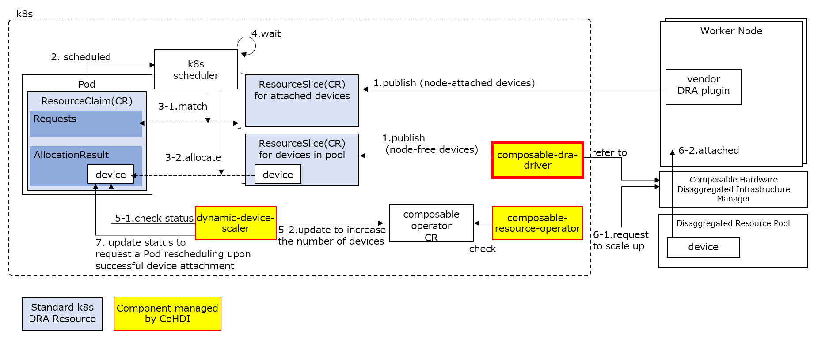

# Dynamic Resource Allocation (DRA) for Composable disaggregated infrastructure in Kubernetes

Composable DRA Driver is a component that works in conjunction with Dynamic Device Scaler to enable dynamic device scaling without OS reboots, based on requests from Pods.  It acts as a bridge between Kubernetes and the Composable Disaggregated Infrastructure manager, exposing available resources managed by the Composable Disaggregated Infrastructure as ResourceSlices within the Kubernetes DRA (Dynamic Resource Allocation) framework.

For a comprehensive understanding of Composable Disaggregated Infrastructure, and the overall dynamic scaling process, please refer to the [Readme](https://github.com/CoHDI/dynamic-device-scaler/blob/main/README.md) of dynamic-device-scaler.

In comparison to the Dynamic Device Scaler, the Composable DRA Driver's role is to:

- Collect resource information from the Composable Disaggregated Infrastructure.
- Provide Kubernetes with a view of available devices, which are those not yet attached to a node, as ResourceSlices.
- Add labels to the node that provide supplementary information about the devices, including upper and lower limits on the number of devices that can be attached.

The following diagram shows how this component is positioned in the overall architecture.

## License

